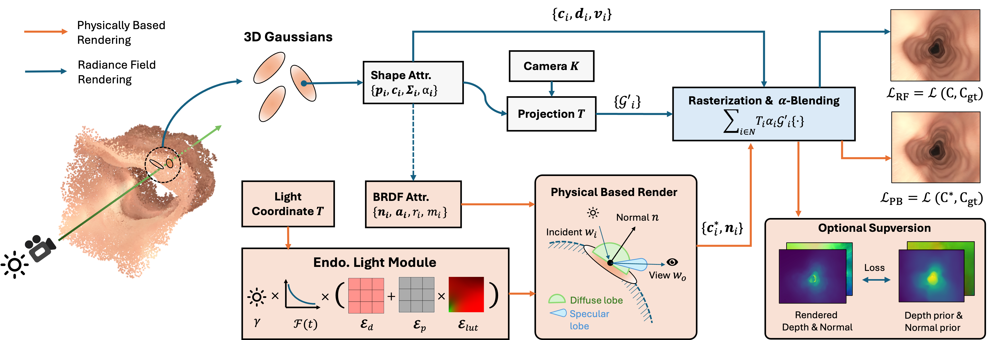

<br />
<p align="center">

  <h1 align="center">Gaussian Splatting with Reflectance Regularization for Endoscopic Scene Reconstruction</h1>

  <p align="center">
   IROS, 2025
    <br />
    <a href="https://chengkunli96.github.io/"><strong>Chengkun Li</strong></a>
    ·
    <a href="https://ck-kai.github.io/"><strong>Kai Chen</strong></a>
    ·
    <a href="https://shiqiu0419.github.io/"><strong>Shi Qiu</strong></a>
    ·
    <a href="https://www.med.cuhk.edu.hk/staff/dr-chan-ying-kuen-jason"><strong>Jason Ying-Kuen Chan</strong></a>
    ·
    <a href="http://www.cse.cuhk.edu.hk/~qdou/"><strong>Qi Dou</strong></a>
  </p>

<!-- <p align="center"> 

</p> -->

  <p align="center">
    <!-- <a href='https://xxxxxxxx'>
      </a> -->
    <a href='https:xxx'></a>
    <a href='https://med-air.github.io/GSR2/' style='padding-left: 0.5rem;'>
      </a>
    <!-- <a href='https://colab.research.google.com/drive/1imGIms3Y4RRtddA6IuxZ9bkP7N2gVVC_' style='padding-left: 0.5rem;'></a> -->
    <!-- <a href='https://youtu.be/lCc1rHePEFQ' style='padding-left: 0.5rem;'>
      </a> -->
  </p>

</p>
<br />

This repository contains the pytorch implementation for the paper [Gaussian Splatting with Reflectance Regularization for Endoscopic Scene Reconstruction](https://github.com/med-air/GSR2), IROS 2025. In this paper, we propose a Gaussian Splatting-based endoscopic scene reconstruction framework with reflectance regularization, to address the shape ambiguity arising from variable lighting in endoscopic scenes.

## Overview


## Code Coming Soon !

## 📝 Citation
Welcom to cite our work, If you find it is useful for your research.
```
```

## 🙋‍♀️ Feedback and Contact
For further questions, pls feel free to contact [Chengkun Li](mailto:chengkunli@link.cuhk.edu.hk).
